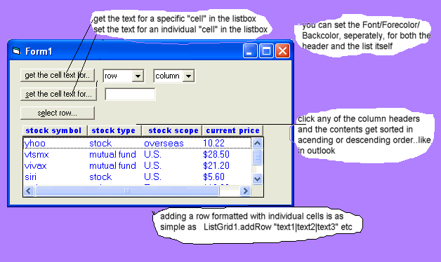



## ListGrid control \(update\)  a cross between a listbox and a listview controls that \>\>\>\>\>

### Description

This is my ListGrid control..so called because it basically merges the functionality of a listbox with a listgrid control. Some of its appealing features are (1) with a short, simple call you can get or set the text of a specified "cell" in the list (2) you create attractive header (2 possible styles) with as many columns as you wish. (3) clicking any of the columns headers cause the list to be sorted in ascending or descending order (alphabetically) just like in outlook or kazaa (4) There is a property call .highest_index which makes for slightly easier looping...for example with the listbox or any of ms controls..there is a property such as the listcount  so if you want to loop through the list you go> for i = 0 to list1.listcount -1  the .highest_index property already takes that into account so now you just loop by>> for i = 0 to listGrid1.highest_index.  The listcount is still available to you as well if you prefer that, (5) your can set the font/forecolor/backcolor, individually for both the header and the list itself.  If you prefer the lightweightness (not a real word i dont think) of the listbox, and used the settabs api to try to increase the functionality of the listbox but felt like you wish you could take the improvements many steps further than that then you will love this control. Suggestions for improvement will be implemented so suggest away.
 
### More Info
 

             |
---                |---
**Submitted On**   |2005-02-06 15:03:22
**By**             |[Evan Toder](https://github.com/Planet-Source-Code/PSCIndex/blob/master/ByAuthor/evan-toder.md)
**Level**          |Intermediate
**User Rating**    |5.0 (25 globes from 5 users)
**Compatibility**  |VB 3\.0, VB 4\.0 \(16\-bit\), VB 4\.0 \(32\-bit\), VB 5\.0, VB 6\.0
**Category**       |[Custom Controls/ Forms/  Menus](https://github.com/Planet-Source-Code/PSCIndex/blob/master/ByCategory/custom-controls-forms-menus__1-4.md)
**World**          |[Visual Basic](https://github.com/Planet-Source-Code/PSCIndex/blob/master/ByWorld/visual-basic.md)
**Archive File**   |[ListGrid\_c184919262005\.zip](https://github.com/Planet-Source-Code/evan-toder-listgrid-control-update-a-cross-between-a-listbox-and-a-listview-controls-that__1-58737/archive/master.zip)

